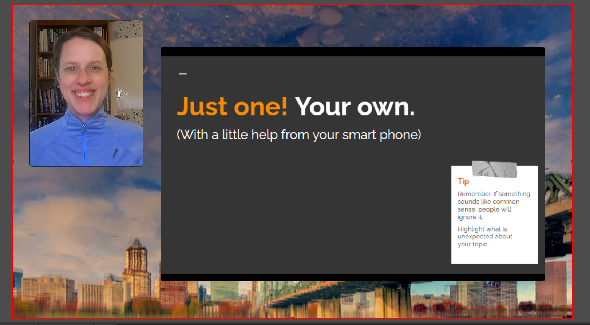

# Open Source Tools to create Picture-in-Pictures screen sharing

 By Allison Sliter (shamelessly stolen from TikTok from someone who shamelessly stole it from a Twitch streamer - but then also tested and updated with more info).

### 1. Start with a background image you like

It needs to be 1920 px by 1080 px or at the very least 16:9 which is the standard aspect ratio for most monitors today.  Maybe this is a good time to bust out some personal branding?  

Import your image in to Gimp: https://www.gimp.org/downloads/

Make two perfectly green (r=0,g-255,b=0 or #00FF00) - one 2:3 for your face, one 16:9 for your slides (If you leave sufficient room for your face, you'll have gaps at the top and bottom around your slides.  Just make it look good to you).

Flatten your layers if neccesary and use the chroma key to remove the green.  Save as a png or other file format that preserves transparency. 

### 2. Go to OBS 

(If you haven't, download it here: https://obsproject.com/)

In Sources add

    - your camera (video capture device)
    - your background (Image)
    - your slides you can do this with:
        - with image slide show if your slides are individual image files like pdfs--turn on manual slide mode--
        - with a browser source if your slides are hosted on something like google slides, 'interact' to present
            - this is probably best if you're rocking a single display.
        - with display capture to just show slides you have on your screen.
        
You can scale and crop each source.  Cropping is as easy as holding alt(cmd for mac(?)) and dragging a side in or out.  Scaling is the same without the hot key.

Make sure your camera source is "sent to back" and so are your slides.

Turn on Virtual Camera

### 3. Go to Your Video Conferencing App

Select "OBS Virtual Camera" from your video device settings and even without screen sharing permissions, you can present!

